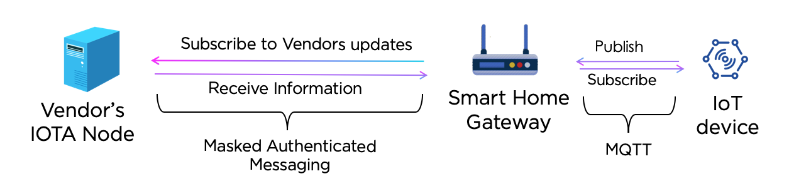

Research : Development of a firmware authenticating and updating scheme for smart home IoT devices using distributed ledger technologies

Sub development : Node.js script for IoT Gateway for recieve IOTA MAM messages from vendor, convert and publish as MQTT messages to IoT end device

Author : Anushka Wijesundara 18M18780 Tokyo Institute of Technology

Repository : github.anushkawijesundara.com

Date : 14/08/2019

Version : v1.0

Version history v0.1 : MAM & MQTT enabled 
                v0.2 : SHA256 verification
                v1.0 : Stable version for MAM and MQTT with SHA256 verification with failsafe mechanisms
                v1.1 : IPFS implementation (Pending)

Last update : 2019/Aug/14
