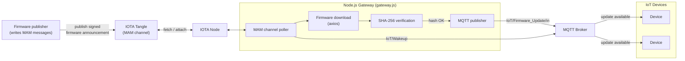
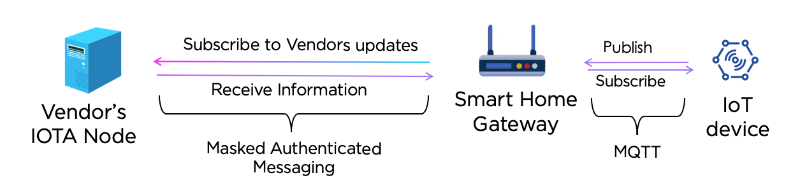

# IOTA MAM IoT Gateway

A small Node.js gateway that lets IoT devices receive **authenticated
firmware updates** over the [IOTA](https://www.iota.org/) Tangle, using the
**Masked Authenticated Messaging (MAM)** protocol instead of a traditional
update server. A manufacturer publishes a signed message describing the
latest firmware (download URL, SHA-256 hash, version) to a MAM channel; the
gateway follows that channel, downloads the referenced binary, verifies its
hash, and announces the new version to devices on the local network over
MQTT.

> **Legacy protocol notice.** This project uses IOTA MAM
> (`@iota/mam` / `iota.lib.js`), which the IOTA Foundation deprecated years
> ago. MAM's conceptual successor, **IOTA Streams**, was itself later wound
> down as IOTA moved to the Chrysalis/Stardust protocol stack, which has no
> direct drop-in replacement for MAM's "sequential encrypted channel"
> pattern. No actively maintained Node.js MAM (or Streams) client exists as
> of this update — `@iota/mam` (last published 2019) and `iota.lib.js`
> (last published 2020) remain the only implementations, and are used here
> unchanged rather than pinning to something that no longer builds. Treat
> this repository as a reference/research implementation, not something to
> run against production IoT fleets without re-evaluating the messaging
> layer.

## What the gateway does

1. Reads the last known MAM channel root from `next.root`.
2. Connects to an IOTA node and follows the MAM channel forward
   (`pollMamChannel` in `gateway.js`), decoding each message as JSON.
3. Each message is expected to contain `file_url`, `file_hash`, and
   `firmware_version` for the latest firmware build.
4. Downloads the firmware binary from `file_url`.
5. Computes its SHA-256 hash and compares it against `file_hash`.
6. If the hash matches, writes a `<device>.version` file and publishes the
   new version on the `IoT/Firmware_Update/in` MQTT topic so devices can
   pick it up.
7. Persists the new channel root back to `next.root` so the next run
   resumes from where it left off.

`fetch-MAM.js` is a small standalone utility for publishing a test packet to
a MAM channel and reading it back — useful for checking connectivity to a
node and the MAM library independent of the gateway logic.

## Architecture


```mermaid
flowchart LR
    subgraph Devices["IoT Devices"]
        D1[Device]
        D2[Device]
    end

    subgraph Gateway["Node.js Gateway (gateway.js)"]
        Poll["MAM channel poller"]
        Verify["SHA-256 verification"]
        Download["Firmware download\n(axios)"]
        MQTTPub["MQTT publisher"]
    end

    Broker["MQTT Broker"]
    Node["IOTA Node"]
    Tangle["IOTA Tangle\n(MAM channel)"]
    Manufacturer["Firmware publisher\n(writes MAM messages)"]

    Manufacturer -- "publish signed\nfirmware announcement" --> Tangle
    Tangle <-- "fetch / attach" --> Node
    Node <--> Poll
    Poll --> Download
    Download --> Verify
    Verify -- "hash OK" --> MQTTPub
    MQTTPub -- "IoT/Firmware_Update/in" --> Broker
    Broker -- "update available" --> D1
    Broker -- "update available" --> D2
    Poll -- "IoT/Wakeup" --> Broker
```

## Requirements

- Node.js 18 or later
- An IOTA node reachable over HTTPS (see `IOTA_NODE` in `gateway.js` /
  `fetch-MAM.js`)
- An MQTT broker reachable on `127.0.0.1:1883` (see `MQTT_OPTIONS` in
  `gateway.js`)
- Write access to the firmware directory (`/var/www/html/firmwares/` by
  default)

## Setup

```bash
npm install
```

Before running, edit the placeholder config files:

- `devices.list` — set `light` to the target device's MAC address (or other
  identifier).
- `next.root` — set `nextroot` to the MAM channel root you want the gateway
  to start following.

Both `gateway.js` and `fetch-MAM.js` currently hardcode the IOTA node URL
and MAM mode (`public` by default) at the top of the file — adjust
`IOTA_NODE`, `MAM_MODE`, and `MAM_SIDEKEY` there if you need a different
node or a restricted/private channel.

## Running

```bash
# Start the gateway: poll the MAM channel, download and verify firmware,
# announce updates over MQTT.
npm start

# One-off: publish a test packet to the MAM channel and read it back.
npm run fetch
```

## Linting

```bash
npm run lint
```

## Project layout

| File | Purpose |
| --- | --- |
| `gateway.js` | Main gateway process: MAM polling, firmware download/verification, MQTT announcements. |
| `fetch-MAM.js` | Standalone publish/fetch utility for testing MAM connectivity. |
| `devices.list` | Device identifiers the gateway manages. |
| `next.root` | Persisted MAM channel root, updated after each successful poll. |

## License

MIT — see [`LICENSE`](./LICENSE).

## Background



Originally developed as part of research on firmware authentication and
update schemes for smart-home IoT devices using distributed ledger
technology (Anushka Wijesundara, Tokyo Institute of Technology, 2019).
